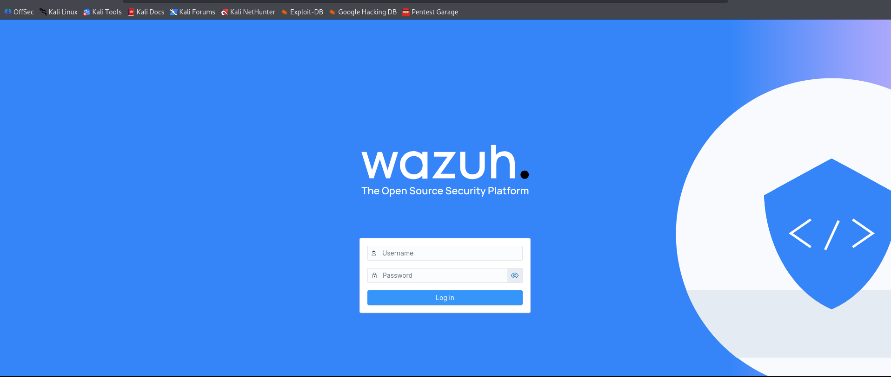
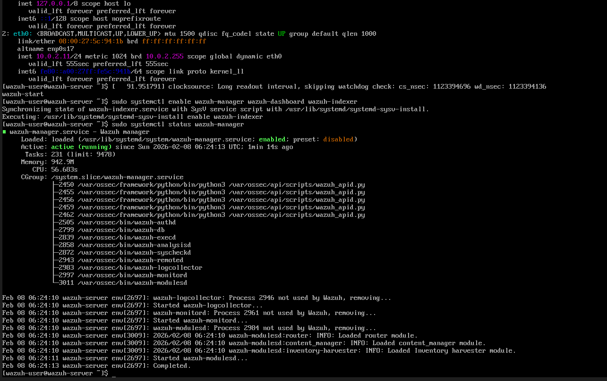
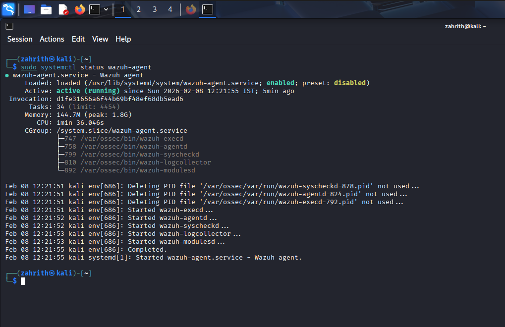
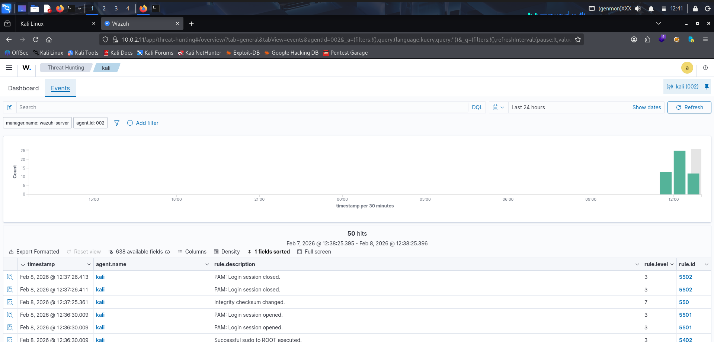
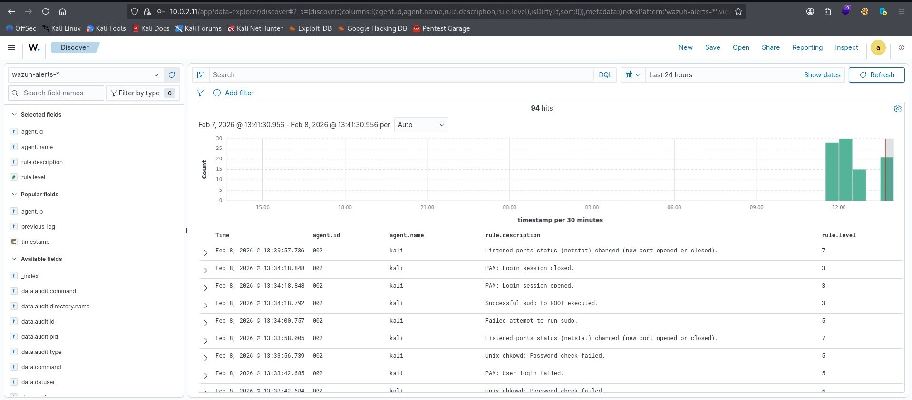
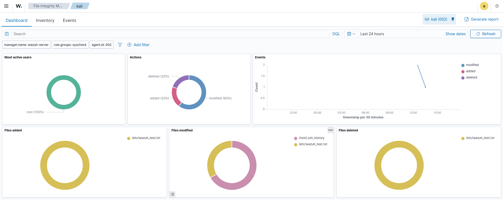
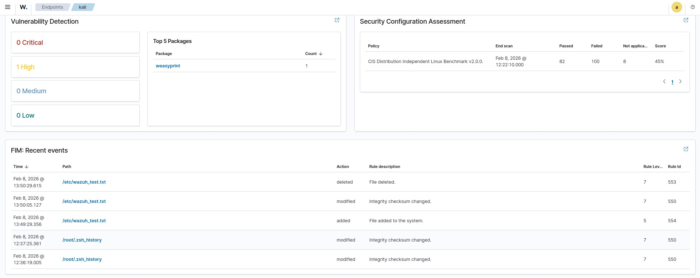

# Wazuh SIEM Lab

## Project Overview

This project demonstrates the deployment and configuration of a Wazuh Security Information and Event Management (SIEM) environment for security monitoring and threat detection.

The lab consists of a Wazuh Manager deployed on a Linux virtual machine and a Kali Linux endpoint configured as a Wazuh Agent. The environment was used to monitor security events, analyze alerts, perform File Integrity Monitoring (FIM), and explore vulnerability detection capabilities.

---

## Technologies Used

- Wazuh SIEM
- Kali Linux
- Linux
- VirtualBox
- File Integrity Monitoring (FIM)
- Threat Hunting
- Vulnerability Detection

---

## Lab Environment

- Wazuh Manager
- Kali Linux Agent
- VirtualBox

---

## Features Demonstrated

- Wazuh Manager deployment
- Agent registration
- Security event monitoring
- Threat hunting
- File Integrity Monitoring (FIM)
- Vulnerability Detection
- Security Configuration Assessment

---

## Project Screenshots

### 1. Wazuh Login

---

### 2. Wazuh Manager Running

---

### 3. Kali Agent Running

---

### 4. Threat Hunting Events

---

### 5. Security Alerts

---

### 6. File Integrity Monitoring

---

### 7. Vulnerability Detection & Security Assessment

---

## Skills Demonstrated

- Security Monitoring
- Threat Detection
- SIEM Administration
- Linux Administration
- Incident Investigation
- File Integrity Monitoring
- Vulnerability Assessment
- Log Analysis

---

## Author

**Sundhus Haneef**

Aspiring SOC Analyst | EC-Council Certified SOC Analyst (CSA) | Certified IT Infrastructure & Cyber SOC Analyst (CICSA v3)
